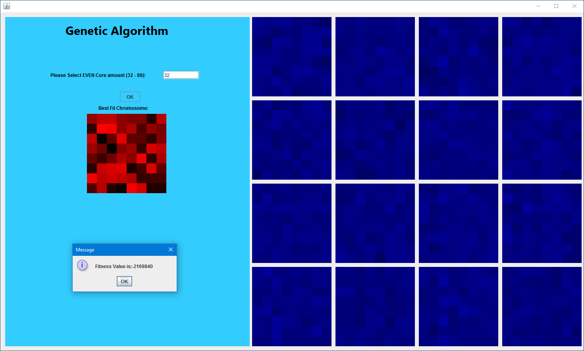

# Parallel-Genetic-Algorithm
This program has been designed utilizing concurrent programming to run multiple threads that will run instances of a Genetic Algorithm in order to find an overall optimal solution.

## Samples From Project

## My Website
[My Website]
(http://cs.oswego.edu/~kzeller)