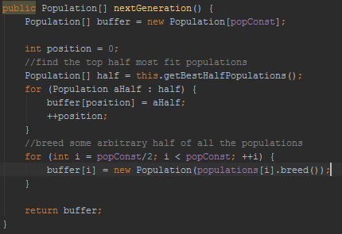
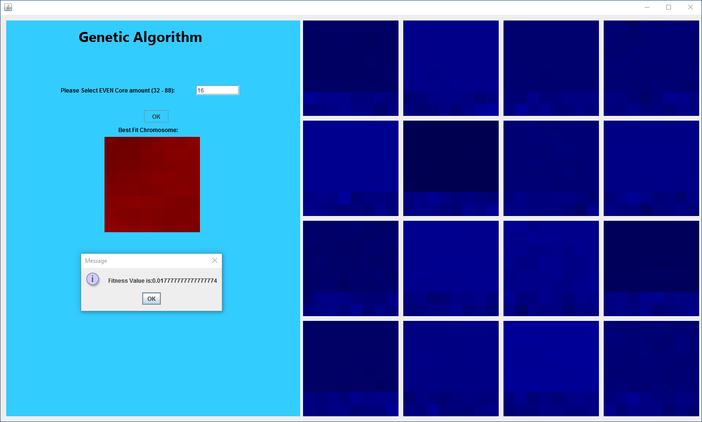
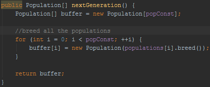
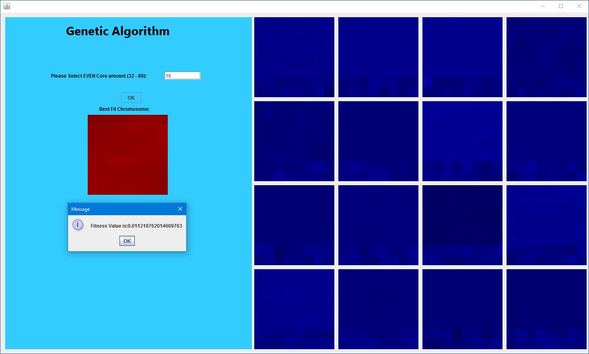

# Parallel-Genetic-Algorithm
This program has been designed utilizing concurrent programming to run multiple threads that will run instances of a Genetic Algorithm in order to find an overall optimal solution. The program has been designed to find the best seating arrangement of students based on their liking to the students adjacent to themselves.

## Samples From Project
###Design Choice 1 : Arbitrarily add another layer of optimization to help the populations converge quicker.

**(WIP)** The results of this plotted over time show a more stable middle ground of a minimized fitness for the best overall solution.

###Design Choice 2 : Breeds all the populations.

**(WIP)** The results of this plotted over time show more variance of a minimized fitness for the best overall solution.

##Conclusion
###Design Choice 1
Leads to a middle ground solution and slashes computation time by taking the top half populations & then breeding an additional arbitrarily selected half of all populations.
###Design Choice 2
Leads can "potentially" lead to a better solution "within a certain probability" and at the cost of additional computation time to breed all the populations.

## My Website
[My Website]
(http://cs.oswego.edu/~kzeller)